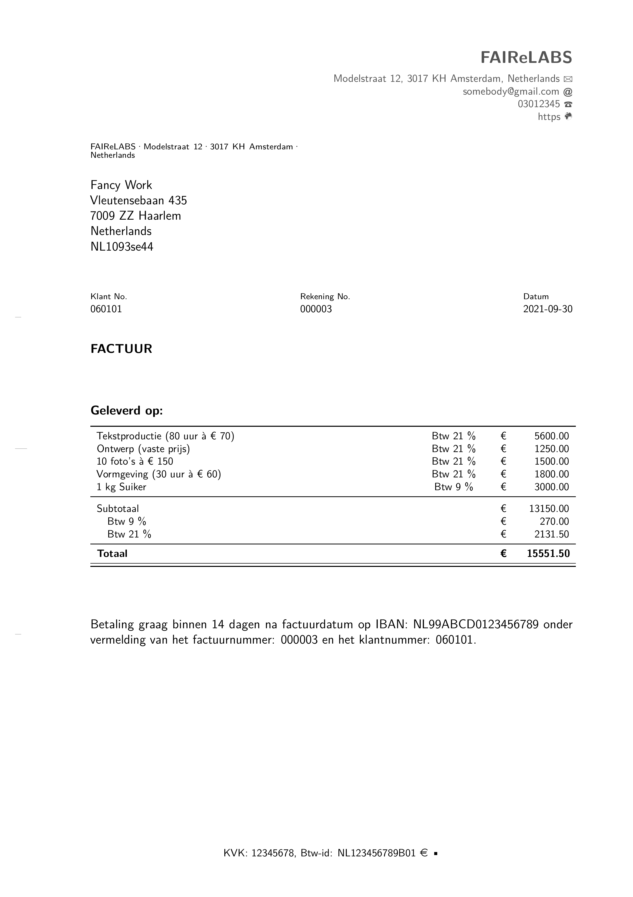

<!-- README.md is generated from README.Rmd. Please edit that file -->

```{r, include = FALSE}
knitr::opts_chunk$set(
  collapse = TRUE,
  comment = "#>",
  fig.path = "man/figures/README-",
  out.width = "100%"
)
```

# bookkeeper

<!-- badges: start -->
<!-- badges: end -->

Bookkeeper is meant to provide a convenient solution for bookkeeping and administration in R. It provides features to create and store invoices, maintain daybooks for e.g., sales and purchases, and a customer data base. In the end, this managing of files can be used to generate a general ledger and an income statement. However, these features are still under development.


## Installation

You can install the released version of bookkeeper from GitHub with devtools:

``` r
# Install point from GitHub: 
# install.packages("devtools")
devtools::install_github("MartinSchobben/bookkeeper")
```


## Example

This is a basic example in Dutch which shows you how to generate a bill and consecutively cast this into an invoice:

```{r example, eval=FALSE}
# load package
library(bookkeeper)

# make customer database
add_customer_entry(
    "Fancy Work",
    NA_character_,
    "Vleutensebaan 435",
    "7009 ZZ Haarlem",
    "Netherlands",
    "NL1093se44"
    )

# initiate bill entry
add_bill_entry(
    "Tekstproductie (80 uur à € 70)",
    21,
    "€",
    5600
  )
# entry
  add_bill_entry(
    "Ontwerp (vaste prijs)",
    21,
    "€",
    1250
  )
# entry
add_bill_entry(
    "10 foto’s à € 150",
    21,
    "€",
    1500
  )
# entry
add_bill_entry(
    "Vormgeving (30 uur à € 60)",
    21,
    "€",
    1800
  )
# entry
add_bill_entry(
    "1 kg Suiker",
    9,
    "€",
    3000
    )
# generate bill
make_bill(lang = "nl")
# render invoice  
render_invoice("060101", lang = "nl")
```


```{r pdf2png, out.width = "85%", echo=FALSE, eval=FALSE}
invoice <- magick::image_read_pdf("man/figures/example_invoice.pdf")
magick::image_write(
  magick::image_convert(invoice,"png"),
  "man/figures/example_invoice.png"
)
```


```{r invoice, echo = FALSE}

```


```{r pkgs, echo=FALSE, message=FALSE}
# following code for loading and writing the bibtex references for the used pkgs
pkgs <- c("dplyr", "tidyr", "tibble", "stringr", "readr", "rlang", "purrr", 
          "devtools", "knitr", "rmarkdown", "komaletter", "bibtex")    
# Get the R reference
rref <- citation()
# Create ref key
rref$key <- "rversion"
hadley <- bibentry(
  key = "Wickham2015",
  bibtype = "Book",
  title = "R packages: organize, test, document, and share your code",
  author =  person("Hadley","Wickham"),
  year = "2015",
  publisher = " O'Reilly Media, Inc.",
  url = "https://r-pkgs.org/"
  )
knitr::write_bib(pkgs, "vignettes/packages.bib", prefix = "")
pkgs <- bibtex::read.bib("vignettes/packages.bib")
bibtex::write.bib(
  purrr::reduce(list(rref, hadley, pkgs), append), 
  file = "vignettes/packages.bib"
  )
```


## Credits

The construction of the R [@rversion] package *bookkeeper* and associated documentation was aided by the packages; *devtools* [@devtools]. The book: *R packages: organize, test, document, and share your code*, written by @Wickham2015, helped me learn many aspects of package development. 

This package relies on a set of external packages from the tidyverse universe, including: *dplyr* [@dplyr], *tidyr* [@tidyr], *tibble* [@tibble], *stringr* [@stringr], *rlang* [@rlang], and *purrr* [@purrr].

The documents, such as invoices and reports, are made possible by *knitr* [@knitr2014 ; @knitr2015], *rmarkdown* [@rmarkdown2018; @rmarkdown2020], and *komaletter* [@komaletter]. 

# References

