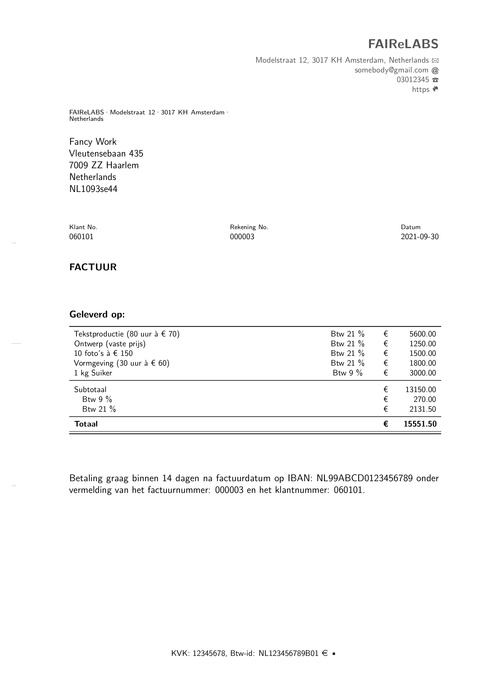

<!-- README.md is generated from README.Rmd. Please edit that file -->

# bookkeeper

<!-- badges: start -->

[](https://travis-ci.com/MartinSchobben/bookkeeper)
[](https://github.com/MartinSchobben/bookkeeper/actions)
[](https://www.repostatus.org/#concept)
[](https://choosealicense.com/licenses/mit/)
[](/commits/master)
[](https://codecov.io/gh/MartinSchobben/bookkeeper?branch=master)
<!-- badges: end -->

Bookkeeper is meant to provide a convenient solution for bookkeeping and
administration in R. It provides features to create and store invoices,
maintain daybooks for e.g., sales and purchases, and a customer data
base. In the end, this managing of files can be used to generate a
general ledger and an income statement. However, these features are
still under development.

## Installation

You can install the released version of bookkeeper from GitHub with
devtools:

``` r
# Install point from GitHub: 
# install.packages("devtools")
devtools::install_github("MartinSchobben/bookkeeper")
```

## Example

This is a basic example in Dutch which shows you how to generate a bill
and consecutively cast this into an invoice:

``` r
# load package
library(bookkeeper)

# make customer database
add_customer_entry(
    "Fancy Work",
    NA_character_,
    "Vleutensebaan 435",
    "7009 ZZ Haarlem",
    "Netherlands",
    "NL1093se44"
    )

# initiate bill entry
add_bill_entry(
    "Tekstproductie (80 uur à € 70)",
    21,
    "€",
    5600
  )
# entry
  add_bill_entry(
    "Ontwerp (vaste prijs)",
    21,
    "€",
    1250
  )
# entry
add_bill_entry(
    "10 foto’s à € 150",
    21,
    "€",
    1500
  )
# entry
add_bill_entry(
    "Vormgeving (30 uur à € 60)",
    21,
    "€",
    1800
  )
# entry
add_bill_entry(
    "1 kg Suiker",
    9,
    "€",
    3000
    )
# generate bill
make_bill(lang = "nl")
# render invoice  
render_invoice("060101", lang = "nl")
```



## Credits

The construction of the R (R Core Team 2021) package *bookkeeper* and
associated documentation was aided by the packages; *devtools* (Wickham,
Hester, and Chang 2021). The book: *R packages: organize, test,
document, and share your code*, written by Wickham (2015), helped me
learn many aspects of package development.

This package relies on a set of external packages from the tidyverse
universe, including: *dplyr* (Wickham et al. 2021), *tidyr* (Wickham
2021), *tibble* (Müller and Wickham 2021), *stringr* (Wickham 2019),
*rlang* (Henry and Wickham 2021), and *purrr* (Henry and Wickham 2020).

The documents, such as invoices and reports, are made possible by
*knitr* (Xie 2014, 2015), *rmarkdown* (Xie, Allaire, and Grolemund 2018;
Xie, Dervieux, and Riederer 2020), and *komaletter* (Nuske,
Eddelbuettel, and Wolen 2021).

# References

<div id="refs" class="references csl-bib-body hanging-indent">

<div id="ref-purrr" class="csl-entry">

Henry, Lionel, and Hadley Wickham. 2020. *Purrr: Functional Programming
Tools*. <https://CRAN.R-project.org/package=purrr>.

</div>

<div id="ref-rlang" class="csl-entry">

———. 2021. *Rlang: Functions for Base Types and Core r and Tidyverse
Features*. <https://CRAN.R-project.org/package=rlang>.

</div>

<div id="ref-tibble" class="csl-entry">

Müller, Kirill, and Hadley Wickham. 2021. *Tibble: Simple Data Frames*.
<https://CRAN.R-project.org/package=tibble>.

</div>

<div id="ref-komaletter" class="csl-entry">

Nuske, Robert, Dirk Eddelbuettel, and Aaron Wolen. 2021. *Komaletter:
Simply Beautiful PDF Letters from Markdown*.
<https://github.com/rnuske/komaletter>.

</div>

<div id="ref-rversion" class="csl-entry">

R Core Team. 2021. *R: A Language and Environment for Statistical
Computing*. Vienna, Austria: R Foundation for Statistical Computing.
<https://www.R-project.org/>.

</div>

<div id="ref-Wickham2015" class="csl-entry">

Wickham, Hadley. 2015. *R Packages: Organize, Test, Document, and Share
Your Code*. O’Reilly Media, Inc. <https://r-pkgs.org/>.

</div>

<div id="ref-stringr" class="csl-entry">

———. 2019. *Stringr: Simple, Consistent Wrappers for Common String
Operations*. <https://CRAN.R-project.org/package=stringr>.

</div>

<div id="ref-tidyr" class="csl-entry">

———. 2021. *Tidyr: Tidy Messy Data*.
<https://CRAN.R-project.org/package=tidyr>.

</div>

<div id="ref-dplyr" class="csl-entry">

Wickham, Hadley, Romain François, Lionel Henry, and Kirill Müller. 2021.
*Dplyr: A Grammar of Data Manipulation*.
<https://CRAN.R-project.org/package=dplyr>.

</div>

<div id="ref-devtools" class="csl-entry">

Wickham, Hadley, Jim Hester, and Winston Chang. 2021. *Devtools: Tools
to Make Developing r Packages Easier*.
<https://CRAN.R-project.org/package=devtools>.

</div>

<div id="ref-knitr2014" class="csl-entry">

Xie, Yihui. 2014. “Knitr: A Comprehensive Tool for Reproducible Research
in R.” In *Implementing Reproducible Computational Research*, edited by
Victoria Stodden, Friedrich Leisch, and Roger D. Peng. Chapman;
Hall/CRC. <http://www.crcpress.com/product/isbn/9781466561595>.

</div>

<div id="ref-knitr2015" class="csl-entry">

———. 2015. *Dynamic Documents with R and Knitr*. 2nd ed. Boca Raton,
Florida: Chapman; Hall/CRC. <https://yihui.org/knitr/>.

</div>

<div id="ref-rmarkdown2018" class="csl-entry">

Xie, Yihui, J. J. Allaire, and Garrett Grolemund. 2018. *R Markdown: The
Definitive Guide*. Boca Raton, Florida: Chapman; Hall/CRC.
<https://bookdown.org/yihui/rmarkdown>.

</div>

<div id="ref-rmarkdown2020" class="csl-entry">

Xie, Yihui, Christophe Dervieux, and Emily Riederer. 2020. *R Markdown
Cookbook*. Boca Raton, Florida: Chapman; Hall/CRC.
<https://bookdown.org/yihui/rmarkdown-cookbook>.

</div>

</div>
